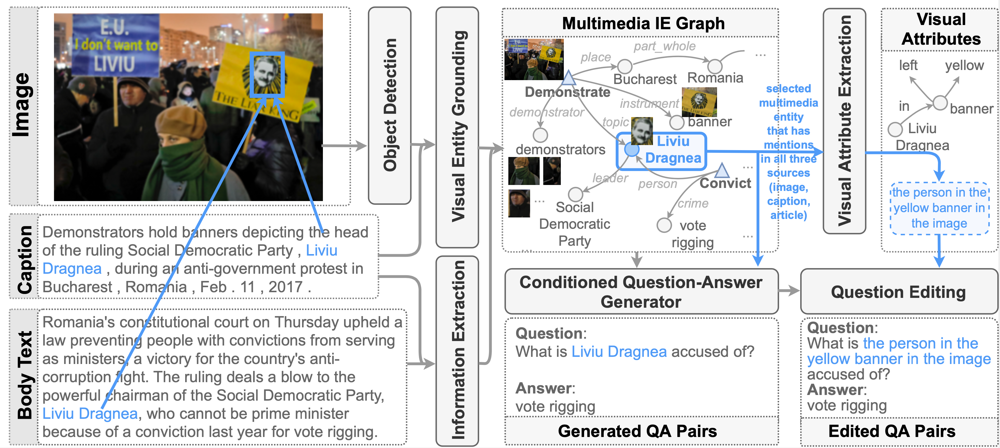

# MuMuQA

## Overview

<p align="center">
  
</p>

This repository contains code and data for the AAAI 2022 paper:
```
MuMuQA: Multimedia Multi-Hop News Question Answering via Cross-Media Knowledge Extraction and Grounding 
```
Arxiv link: [https://arxiv.org/pdf/2112.10728.pdf](https://arxiv.org/pdf/2112.10728.pdf)                                                     
                                                          
### Data

The training set contains 21575 examples that have been automatically generated using the pipeline described in the paper.
                                                          
The dev and test sets contain 263 and 1121 manually annotated examples respectively. 

You can find the data [here](https://drive.google.com/file/d/1fmnZvDhHd8oTmbWjl40uZlpREwHvICAR/view?usp=sharing).
                                                          
The eval data (dev.json/test.json) has the following fields for each example:
- `question`: Question text
- `context`: The news article text
- `caption`: The news caption text
- `image`: The url to the image
- `id`: Example ID
- `answer`: Final answer to the question 
- `bridge`: Bridge answer
- `voa_example_id`: VOA Corpus example ID
- `voa_image_id`: Image ID within VOA corpus

The train data (train.json) has the following fields for each example:
- `context`: The news article text
- `caption`: The news caption text
- `question_generation_context`: Subset of news article text from which question was generated
- `entity_in_question`: Conditioning entity (within `question_generation_context`) that was used during question generation
- `generated_question`: Question that was output from the conditioned question generation model
- `question_phrase_replaced`: Phrase within `generated question` that was replaced with an image reference
- `question`: Final question text   
- `image`: The url to the image
- `answer`: Final answer to the question 
- `answer_start`: Start character offset for answer span within `context`
- `answer_end`: End character offset (inclusive) for answer span within `context`
- `bridge`: Bridge answer
- `bridge_start`: Start character offset for bridge answer span within `caption`
- `bridge_end`: End character offset (inclusive) for bridge answer span within `caption`
- `voa_example_id`: VOA Corpus example ID
- `voa_image_id`: Image ID within VOA corpus      

### Eval

The output predictions need to be dictionary with the `Example ID` as the key and the answer string as the value. We use a SQuAD-style string F1 metric for evaluation.

To run evaluation on with the final answer as predictions:
```
python mmqa_eval.py <path to gold file> <path to predictions file> 
```

To run evaluation on with the bridge answer as predictions:
```
python mmqa_eval.py <path to gold file> <path to predictions file> --bridge_eval
```                                                         
                                                         
### Citation

If you used this dataset in your work, please consider citing our paper:
```
@article{reddy2021mumuqa,
  title={MuMuQA: Multimedia Multi-Hop News Question Answering via Cross-Media Knowledge Extraction and Grounding},
  author={Reddy, Revanth Gangi and Rui, Xilin and Li, Manling and Lin, Xudong and Wen, Haoyang and Cho, Jaemin and Huang, Lifu and Bansal, Mohit and Sil, Avirup and Chang, Shih-Fu and others},
  journal={arXiv preprint arXiv:2112.10728},
  year={2021}
}                                                    
